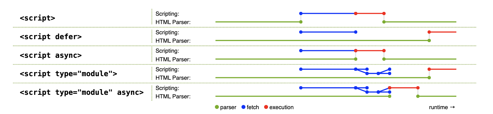

# Optimize Resource Loading

### Render blocking
As was discussed in the previous module, CSS is a render-blocking resource, as it blocks the browser from rendering any content until the ```CSS Object Model (CSSOM)``` is constructed. The browser blocks rendering to prevent a ```Flash of Unstyled Content (FOUC)```, which is undesirable from a user experience standpoint.

### Parser blocking
A parser-blocking resource interrupts the HTML parser, such as a ```<script>``` element without async or defer attributes. When the parser encounters a ```<script>``` element, the browser needs to evaluate and execute the script before proceeding with parsing the rest of the HTML. 
This is by design, as scripts may modify or access the DOM during a time while it is still being constructed.

```
<!-- This is a parser-blocking script: -->
<script src="/script.js"></script>
```

***When using external JavaScript files (without async or defer), the parser is blocked from when the file is discovered until it is downloaded, parsed, and executed. When using inline JavaScript, the parser is similarly blocked until the inline script is parsed and executed.***

```
element.getComputedStyle()
```


## The preload scanner

The preload scanner is a browser optimization in the form of a secondary HTML parser that scans the raw HTML response to find and speculatively fetch resources before the primary HTML parser would otherwise discover them

---
- To take advantage of the preload scanner, critical resources should be included in HTML markup sent by the server. The following resource loading patterns are not discoverable by the preload scanner:
- Images loaded by CSS using the background-image property. These image references are in CSS, and can't be discovered by the preload scanner.
- Dynamically-loaded scripts in the form of ```<script>``` element markup injected into the DOM using JavaScript or modules loaded using dynamic ```import()```.
- HTML rendered on the client using JavaScript. Such markup is contained within strings in JavaScript resources, and isn't discoverable by the preload scanner.
CSS ```@import``` declarations.


These resource loading patterns are all late-discovered resources, and therefore don't benefit from the preload scanner. Avoid them whenever possible. If avoiding such patterns isn't possible, however, you may be able to use a ```preload``` hint to avoid resource discovery delays.

Note: 
***Preload should be used sparsely and only for late-discovered resources. Overusing the preload resource hint can deviate network bandwidth to less-critical resources.***


## CSS
CSS determines the presentation and layout of a page. As described earlier, CSS is a render-blocking resource, so optimizing your CSS could have a considerable impact on overall page load time.

### Minification
Minifying CSS files reduces the file size of a CSS resource, making them quicker to download. This is accomplished primarily by removing content from a source CSS file such as spaces and other invisible characters, and outputting the result to a newly optimized file:

```
/* Unminified CSS: */

/* Heading 1 */
h1 {
  font-size: 2em;
  color: #000000;
}

/* Heading 2 */
h2 {
  font-size: 1.5em;
  color: #000000;
}
```


```
/* Minified CSS: */
h1,h2{color:#000}h1{font-size:2em}h2{font-size:1.5em}
```


***In its most basic form, CSS minification is an effective optimization that could improve your website's FCP, and perhaps even LCP in some cases. Tools such as bundlers can automatically perform this optimization for you in production builds.***


### Remove unused CSS
Before rendering any content, the browser needs to download and parse all style sheets. The time required to complete parsing also includes styles that are unused on the current page. If you are using a bundler that combines all CSS resources into a single file, your users are likely downloading more CSS than needed to render the current page.


To discover unused CSS for the current page, use the Coverage tool in Chrome DevTools.

```
In Mac First Open the Developer Tool Bar
then 
(Cmd + Shift) + P

Type: Show Coverage
```

### Avoid CSS @import declarations
While it may seem convenient, you should avoid @import declarations in CSS:

```
/* Don't do this: */
@import url('style.css');
```

- Similarly to how the ```<link>``` element works in HTML, the @import declaration in CSS lets you import an external CSS resource from within a style sheet. 
- The major difference between these two approaches is that the HTML ```<link>``` element is part of the HTML response, and therefore discovered much sooner than a CSS file downloaded by an ```@import``` declaration.


- The reason for this is that in order for an @import declaration to be discovered, the CSS file that contains it must first be downloaded. This results in what is known as a ```request chain``` which—in the case of CSS—delays how long it takes for a page to initially render. 
- Another drawback is that style sheets loaded using an ```@import``` declaration can't be discovered by the preload scanner, and therefore become late-discovered render-blocking resources.


```
<!-- Do this instead: -->
<link rel="stylesheet" href="style.css">
```

In most cases, you can replace the @import by using a ```<link rel="stylesheet">``` element. ```<link>``` elements allow style sheets to be downloaded concurrently and reduces overall load time, as opposed to ```@import``` declarations, which downloads style sheets consecutively.


### Inline critical CSS
The time it takes to download CSS files can increase a page's FCP. Inlining critical styles in the document ```<head> ```eliminates the network request for a CSS resource, and—when done correctly—can improve initial load times when a user's browser cache is not primed. The remaining CSS can be loaded asynchronously, or appended at the end of the ```<body> ``` element.

```
<head>
  <title>Page Title</title>
  <!-- ... -->
  <style>h1,h2{color:#000}h1{font-size:2em}h2{font-size:1.5em}</style>
</head>
<body>
  <!-- Other page markup... -->
  <link rel="stylesheet" href="non-critical.css">
</body>
```


### JavaScript
JavaScript drives most of the interactivity on the web, but it comes at a cost. Shipping too much JavaScript can make your web page slow to respond during page load, and may even cause responsiveness issues that slow down interactions—both of which can be frustrating for users


### Render-blocking JavaScript
When loading ```<script>``` elements without the defer or async attributes, the browser blocks parsing and rendering until the script is downloaded, parsed, and executed. Similarly, inline scripts block the parser until the script is parsed and executed.

### async versus defer
```async``` and ```defer``` allow external scripts to load without blocking the HTML parser while scripts (including inline scripts) with ```type="module"``` are deferred automatically. However, async and defer have some differences that are important to understand.



- Scripts loaded with async are parsed and executed immediately once downloaded, 
- while scripts loaded with defer are executed when HTML document parsing is finished—this occurs at the same time as the browser's ```DOMContentLoaded event```. 
- Additionally, async scripts may execute out-of-order, while defer scripts are executed in the order in which they appear in the markup.

