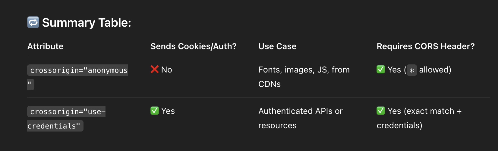

# Assist the browser with resource hints

Resource hints can help developers further optimize page load time by informing the browser how to load and prioritize resources

An initial set of resource hints such as ```preconnect``` and ```dns-prefetch``` were the first to be introduced.

Resource hints instruct the browser to perform certain actions ahead of time that could improve loading performance. Resource hints can perform actions such as performing early DNS lookups, connecting to servers ahead of time, and even fetching resources before the browser would ordinarily discover them.


### preconnect
The ```preconnect``` hint is used to establish a connection to another origin from where you are fetching critical resources.

```
<link rel="preconnect" href="https://example.com">
```


A common use case for preconnect is Google Fonts. Google Fonts recommends that you preconnect to the ```https://fonts.googleapis.com``` domain that serves the @font-face declarations and to the ```https://fonts.gstatic.com``` domain that serves the font files.

```
<link rel="preconnect" href="https://fonts.googleapis.com">
<link rel="preconnect" href="https://fonts.gstatic.com" crossorigin>
```

We are calling a different origin, so we need crossorigin to tell the browser to handle it as a cross-origin request, especially for font files and certain other types of resources.”


The difference between ```crossorigin="anonymous"``` and ```crossorigin="use-credentials"``` lies in whether the browser sends cookies, HTTP authentication, or client-side certificates when making a cross-origin request.




### dns-prefetch
```dns-prefetch``` is a browser performance optimization technique that tells the browser:
```
“Hey browser, go ahead and resolve the DNS for this domain early, even before we actually request anything from it.”
```

This is useful when your page loads resources (like fonts, images, or scripts) from external domains.


### 💡 Why it's needed
When the browser encounters a resource from another domain (like https://fonts.googleapis.com), it must first:

1. Resolve the domain name to an IP (DNS lookup)
2. Create a connection (TCP + TLS handshake)
3. Request the resource

DNS lookup alone can take 20–120 ms depending on the network.

By pre-resolving the DNS earlier, you save time later when that domain is actually used.

```
Example: 
<link rel="dns-prefetch" href="https://fonts.googleapis.com">
```

***It doesn’t actually fetch anything, just resolves the domain name***.

### ✅ When to use dns-prefetch
You are loading assets (like images, fonts, APIs) from external domains
And you want to improve the first load performance


### preload
The ```preload``` directive is used to initiate an early request for a resource required for rendering the page:

```
<link rel="preload" href="/lcp-image.jpg" as="image">
```

- Preload directives should be limited to late-discovered critical resources. 
- The most common use cases are font files, CSS files fetched - through ```@import``` declarations, or CSS background-image resources that are likely to be Largest Contentful Paint (LCP) candidates. 
- In such cases, these files wouldn't be discovered by the preload scanner as the resource is referenced in external resources.

---
- Similarly to preconnect, the preload directive requires the crossorigin attribute if you are preloading a CORS resource—such as fonts. 
- If you don't add the crossorigin attribute—or add it for non-CORS requests—then the resource is downloaded by the browser twice, wasting bandwidth that could have been better spent on other resources.

```
<link rel="preload" href="/font.woff2" as="font" crossorigin>
```

### prefetch
The prefetch directive is used to initiate a low priority request for a resource likely to be used for future navigations:

```
<link rel="prefetch" href="/next-page.css" as="style">
```


```<link rel="prefetch">``` is a resource hint that tells the browser:
***This resource will be needed soon, so download it in the background during idle time.***

The browser:

- Downloads /about.html in the background (low priority).
- Stores it in the HTTP cache.
- Keeps it ready so that if the user later navigates to /about.html, it's loaded almost instantly from the cache — not from the network again.

## 🧠 Important Notes:
- Prefetched resources are stored in the HTTP cache (not memory cache).
- If the resource is not used soon, the browser might evict it (especially on low storage or memory).
- Prefetching doesn’t execute JS or apply CSS — it just fetches and stores.
- For SPAs (like React apps), dynamic routes and chunks can be prefetched to speed up route changes.


## Fetch Priority API
You can use the Fetch Priority API through its fetchpriority attribute to increase the priority of a resource. You can use the attribute with ```<link>, , and <script>``` elements.

```
Example: 
<div class="gallery">
  <div class="poster">
    
  </div>
  <div class="thumbnails">
    
    
    
  </div>
</div>
```


