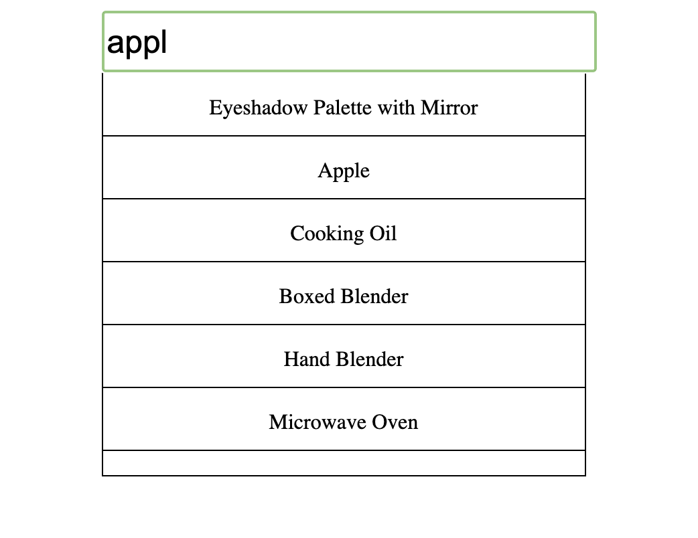

# Create Auto-suggestion Box in react

### Requirements
- Suggestion should show, based on the user text
- When user click outside suggestion box should get closed
- When user again click on search bar suggestion box should visible.

```
import { useEffect, useRef, useState } from "react";

export default function AutoComplete() {
  const URL = "https://dummyjson.com/products/search?q=";
  const [data, setData] = useState([]);
  const [text, setText] = useState("");
  const [showSuggestion, setShowSuggestion] = useState(false);
  const containerRef = useRef(null);

  const fetchEntries = async (searchText) => {
    try {
      const updatedURL = URL + searchText;
      let res = await fetch(updatedURL);
      let jsonValue = await res.json();
      setData(jsonValue.products || []);
    } catch (err) {
      console.error(err);
      setData([]);
    }
  };

  // Close suggestions if clicked outside
  useEffect(() => {
    const handleClick = (e) => {
      if (containerRef.current && !containerRef.current.contains(e.target)) {
        setShowSuggestion(false);
      }
    };

    document.addEventListener("click", handleClick);
    return () => document.removeEventListener("click", handleClick);
  }, []);

  // Fetch when text changes
  useEffect(() => {
    if (text.trim().length > 0) {
      fetchEntries(text);
      setShowSuggestion(true);
    } else {
      setData([]);
      setShowSuggestion(false);
    }
  }, [text]);

  return (
    <section ref={containerRef} className="auto_complete">
      <input
        id="suggestion_input_box"
        type="text"
        value={text}
        onFocus={() => setShowSuggestion(true)}
        onChange={(e) => setText(e.target.value)}
      />
      {showSuggestion && text.trim().length > 0 && (
        <div className="suggestions">
          {data.length > 0 ? (
            data.map((item, ind) => (
              <p className="entries" key={ind}>
                {item.title}
              </p>
            ))
          ) : (
            <p className="entries">No entries found</p>
          )}
        </div>
      )}
    </section>
  );
}
```


