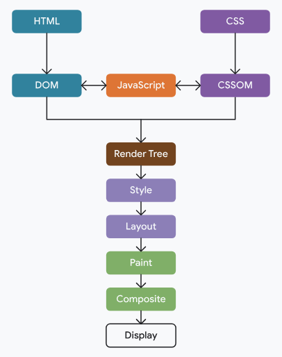

# Understand the critical path

The critical rendering path refers to the steps involved until the web page starts rendering in the browser. 

To render pages, browsers need the HTML document itself as well as all the critical resources necessary for rendering that document.

## Progressive rendering
- Unlike native applications that are installed before use, browsers cannot depend on websites having all the resources necessary to render the page.
- Therefore, browsers are very good at rendering pages progressively. 


---
- Once the browser has resources to render a page, it will typically begin to do so. The choice therefore becomes about when to render: when is too early?

- If the browser renders as soon as possible when it just has some HTML—but before it has any CSS or necessary JavaScript—then the page will momentarily look broken and change considerably for the final render. This is a worse experience than initially presenting a blank screen for a time until the browser has more of these resources needed for an initial render that offers a better user experience.

- On the other hand, if the browser waits for all resources to be available instead of doing any sequential rendering, then the user will be left waiting for a long time; often unnecessarily so if the page was usable at a much earlier point in time.

- The browser needs to know what the minimum number of resources it should wait for in order to avoid presenting an obviously broken experience. 

- On the other hand, the browser also shouldn't wait longer than necessary before presenting the user with some content. The sequence of steps the browser takes before performing that initial render is known as the ***critical rendering path***.


## The (critical) rendering path
The rendering path involves the following steps:
- Constructing the Document Object Model (DOM) from the HTML.
- Constructing the CSS Object Model (CSSOM) from the CSS.
- Applying any JavaScript that alters the DOM or CSSOM.
- Constructing the render tree from the DOM and CSSOM.
- Perform style and layout operations on the page to see what elements fit where.
- Paint the pixels of the elements in memory.
- Composite the pixels if any of them overlap.
- Physically draw all the resulting pixels to screen.



Only after all these steps have been completed, will the user see content on the screen.


## What resources are on the critical rendering path?
The browser needs to wait for some critical resources to download before it can complete the initial render. These resources include:

- Part of the HTML.
- Render-blocking CSS in the <head> element.
- Render-blocking JavaScript in the <head> element.

Importantly, for the initial render, the browser will not typically wait for:

- All of the HTML.
- Fonts.
- Images.
- Non-render-blocking JavaScript outside of the ***<head>*** element ***for example, ```<script>``` elements placed at the end of the HTML***.
- Non-render-blocking CSS outside of the ```<head>``` element, or CSS with a media attribute value that does not apply to the current viewport.


# Render-blocking resources
Some resources are deemed so critical that the browser pauses page rendering until it has dealt with them. CSS falls into this category by default.

When a browser sees CSS—whether it's inline CSS in a ```<style> ``` element, or an externally referenced resource specified by a ```<link rel=stylesheet href="...">``` element—the browser avoids rendering any more content until it has completed downloading and processing that CSS.

```<link rel=stylesheet href="..." media=print>```. This has been used in the past to allow non-critical CSS to load in a non-render blocking fashion.

A more recent innovation is the ```blocking=render``` attribute, added to Chrome 105. This allows developers to explicitly mark a ```<link>, <script> or <style> element as rendering-blocking ```until the element is processed, but still allowing the parser to continue processing the document in the meantime.


# Parser-blocking resources
JavaScript by default is parser-blocking (unless specifically marked as asynchronous or deferred), as JavaScript can change the DOM or the CSSOM upon its execution. 

Therefore, it's not possible for the browser to continue processing other resources until it knows the full impact of the requested JavaScript on a page's HTML. Synchronous JavaScript therefore blocks the parser.

# 🧠 What is the Preload Scanner?
The Preload Scanner is a parallel mechanism in the browser that looks ahead in the HTML to find resources (like scripts, images, CSS) and start downloading them before the main parser reaches them.

### 🧩 Why is it needed?
HTML is parsed top to bottom, and scripts can block parsing.
To avoid waiting, browsers created the preload scanner to speculatively preload resources early.

### 🚀 How it works (simplified):
- Browser starts parsing your HTML document.
- At the same time, the preload scanner runs in parallel.
- It scans ahead and finds:
```

```

```
<link rel="stylesheet">
```
```
<script src="...">
```
```
<video>, <audio>, etc.
```

It starts fetching those files immediately, even before the full document is parsed.

This helps reduce time to first render and overall load time.

📦 Example:
```
<!DOCTYPE html>
<html>
  <head>
    <title>My App</title>
    <link rel="stylesheet" href="styles.css" />
    <script src="main.js"></script>
  </head>
  <body>
    
  </body>
</html>
```

The preload scanner sees ```styles.css```, ```main.js```, and ```logo.png```.

It starts downloading them immediately while the main HTML parser is still working on other parts.

### 🧪 Related Performance Tags
You can help the preload scanner by explicitly telling it what to prioritize:

```
<link rel="preload" href="hero.jpg" as="image">
<link rel="preload" href="font.woff2" as="font" type="font/woff2" crossorigin="anonymous">
```

These hints help preload scanner not miss anything important (like fonts or scripts loaded via JS).


# Identify blocking resources
Many performance auditing tools identify render and parser-blocking resources. 
[Online site - WebPageTest](https://www.webpagetest.org/)