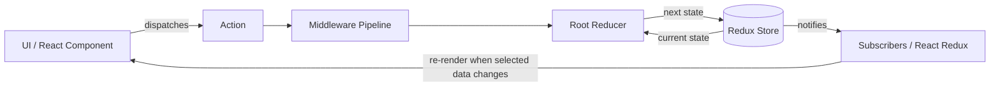

# Redux Architecture and Internal Working

Redux is a predictable state container for JavaScript applications. It stores shared application state in one place and updates that state through a strict, one-way data flow.

> Redux itself is framework-independent. React applications normally connect to it with **React Redux**.

## 1. The Core Idea

Redux follows three principles:

1. **Single source of truth**: shared state is stored in one object tree inside one store.
2. **State is read-only**: application code requests changes by dispatching actions; it does not directly mutate store state.
3. **Changes are made with pure reducers**: reducers calculate the next state from the current state and an action.

A minimal mental model is:

```text
UI → dispatch(action) → reducer(currentState, action) → nextState → UI update
```


## 3. Redux Architecture



Redux uses a **unidirectional data flow**:

1. The UI reads state from the store.
2. A user interaction or another event creates an action.
3. The action is sent to `store.dispatch()`.
4. Middleware can inspect, transform, delay, or react to the action.
5. Reducers calculate the next state.
6. The store saves the next state and notifies subscribers.
7. React Redux checks selected values and re-renders relevant components.

## 4. Main Building Blocks

### 4.1 Store

The store holds the state tree and coordinates updates. A Redux store exposes a small API:

- `store.getState()` returns the current state.
- `store.dispatch(action)` starts an update.
- `store.subscribe(listener)` registers a change listener.
- `replaceReducer(nextReducer)` replaces the current root reducer, usually for code splitting or hot reloading.

```js
import { createStore } from "redux";

const store = createStore(rootReducer);
```

Modern Redux applications should normally use Redux Toolkit:

```js
import { configureStore } from "@reduxjs/toolkit";

const store = configureStore({
  reducer: rootReducer,
});
```

`configureStore()` creates a Redux store while also setting up useful development checks, Redux DevTools, and default middleware.

### 4.2 State

State is the data currently held by the store:

```js
{
  todos: {
    items: [],
    status: "idle"
  },
  user: {
    profile: null
  }
}
```

State should contain serializable application data. Values such as DOM nodes, promises, class instances, and functions generally do not belong in Redux state.

Not every value belongs in Redux. Keep local UI state—such as an input's temporary value or whether a local menu is open—in the component unless other parts of the application need it.

### 4.3 Actions

An action is a plain object that describes **what happened**. It must have a `type` property.

```js
const action = {
  type: "todos/todoAdded",
  payload: {
    id: 1,
    text: "Learn Redux"
  }
};
```

The action describes an event; it does not contain the state-update algorithm.

An action creator is a function that creates an action:

```js
const todoAdded = (todo) => ({
  type: "todos/todoAdded",
  payload: todo,
});
```

### 4.4 Reducers

A reducer calculates the next state:

```js
nextState = reducer(currentState, action);
```

A reducer must:

- produce the same result for the same inputs;
- avoid side effects such as API requests, timers, and random values;
- avoid mutating its arguments;
- return the existing state for unknown actions.

```js
const initialState = { items: [] };

function todosReducer(state = initialState, action) {
  switch (action.type) {
    case "todos/todoAdded":
      return {
        ...state,
        items: [...state.items, action.payload],
      };
    default:
      return state;
  }
}
```

Redux checks object identity, so immutable updates are important. If a reducer mutates an existing object and returns the same reference, subscribers may not detect the change correctly.

Redux Toolkit uses Immer, allowing reducer code that looks mutable while still producing immutable state:

```js


The apparent mutation is applied to an Immer draft. Immer creates a new immutable result and structurally shares unchanged data.


### 4.7 Middleware

Middleware runs between `dispatch()` and the reducer. It is commonly used for logging, async workflows, analytics, and error reporting.

Its conceptual shape is:

```js
const middleware = (storeAPI) => (next) => (action) => {
  // Code before the next middleware/reducer
  const result = next(action);
  // Code after the next middleware/reducer
  return result;
};
```

- `storeAPI` provides `dispatch` and `getState`.
- `next(action)` passes the action to the next middleware.
- The last `next(action)` reaches the store's original dispatch and reducer.
- `storeAPI.dispatch(action)` starts again at the first middleware.


## 8. Redux Thunk and Internal Async Flow

### What Is a Thunk?

A **thunk** is a function that delays work until the function is called. In Redux, a thunk is a function dispatched to the store instead of a plain action object.

```js
const normalAction = { type: "todos/fetchStarted" };

const thunkAction = (dispatch, getState) => {
  // Delayed logic goes here.
};
```

The Redux store itself only accepts plain-object actions. Redux Thunk is middleware that teaches `dispatch()` how to handle functions. When it receives a function, it executes the function with these arguments:

- `dispatch`: dispatches additional actions or thunks;
- `getState`: reads the latest Redux state;
- `extraArgument`: optionally provides an API client or another dependency.

### Why Do We Need Thunks?

Reducers must be synchronous and free of side effects, so they cannot make HTTP requests, wait for timers, read storage, or perform other async work. Components could perform that work directly, but doing so spreads business logic across the UI and makes it harder to reuse and test.

Thunks provide a place outside the reducer for logic that needs to:

- run asynchronous operations;
- dispatch several actions over time;
- inspect current state before deciding what to do;
- reuse logic from different components;
- keep side effects and business decisions out of the UI.

Thunks are not limited to async code. They can also contain synchronous logic that needs access to `dispatch()` or `getState()`.

### Configuring Thunk Middleware

Redux Toolkit's `configureStore()` includes thunk middleware by default:

```js
import { configureStore } from "@reduxjs/toolkit";

const store = configureStore({
  reducer: rootReducer,
});
```

With legacy Redux setup, it must be applied explicitly:

```js
import { applyMiddleware, createStore } from "redux";
import { thunk } from "redux-thunk";

const store = createStore(rootReducer, applyMiddleware(thunk));
```

### Writing and Dispatching a Thunk

A thunk action creator is a function that returns the actual thunk function. This outer function accepts values from the component, while the inner function receives Redux's `dispatch` and `getState`:

```js
const fetchTodos = () => async (dispatch, getState) => {
  const { status } = getState().todos;

  if (status === "loading") {
    return;
  }

  dispatch({ type: "todos/fetchStarted" });

  try {
    const response = await fetch("/api/todos");
    const todos = await response.json();
    dispatch({ type: "todos/fetchSucceeded", payload: todos });
    return todos;
  } catch (error) {
    dispatch({ type: "todos/fetchFailed", payload: error.message });
    throw error;
  }
};
```

The component dispatches the returned function just like an action:

```js
function TodoPage() {
  const dispatch = useDispatch();

  const loadTodos = async () => {
    try {
      const todos = await dispatch(fetchTodos());
      console.log("Loaded todos:", todos);
    } catch (error) {
      console.error("Loading failed:", error);
    }
  };

  return <button onClick={loadTodos}>Load todos</button>;
}
```

Thunk middleware returns whatever the thunk function returns. Therefore, if the thunk returns a promise, the component can await `dispatch(fetchTodos())`.