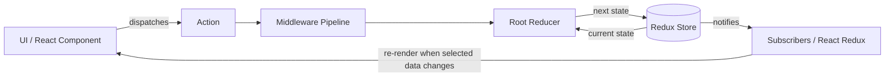
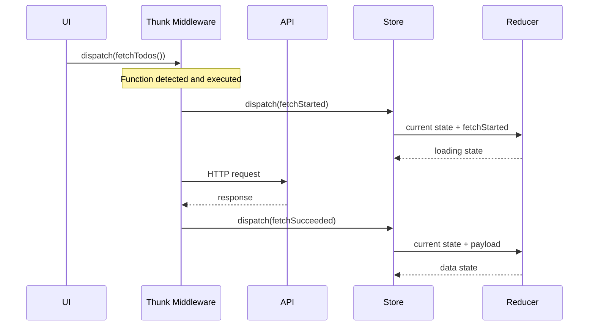

# Redux Architecture and Internal Working

Redux is a predictable state container for JavaScript applications. It stores shared application state in one place and updates that state through a strict, one-way data flow.

> Redux itself is framework-independent. React applications normally connect to it with **React Redux**.

## 1. The Core Idea

Redux follows three principles:

1. **Single source of truth**: shared state is stored in one object tree inside one store.
2. **State is read-only**: application code requests changes by dispatching actions; it does not directly mutate store state.
3. **Changes are made with pure reducers**: reducers calculate the next state from the current state and an action.

A minimal mental model is:

```text
UI → dispatch(action) → reducer(currentState, action) → nextState → UI update
```

## 2. Why Do We Need Redux?

As an application grows, many components may need to read or update the same data. Examples include the logged-in user, shopping cart, notifications, application settings, and data loaded from an API.

Without a dedicated state-management approach, shared state is often passed through many component levels:

```text
App
└── Layout (receives user and cart)
    ├── Header (receives user and cart)
    │   └── CartButton (finally uses cart)
    └── Page
        └── ProductList
            └── Product (needs to update cart)
```

This is called **prop drilling**. Intermediate components receive data or callback functions only so they can pass them to another component. Moving state to a global variable may avoid prop drilling, but it introduces other problems: uncontrolled mutations, unclear update sources, difficult debugging, and no reliable way to notify the UI.

Redux provides a structured solution when state is shared widely or updated by many parts of an application.

### Problems Redux Solves

| Problem | How Redux Helps |
| --- | --- |
| Prop drilling | Components can select shared data directly from the store instead of receiving it through every parent. |
| Scattered state | Shared application state has a known location and consistent structure. |
| Unpredictable updates | State changes follow one path: action → reducer → next state. |
| Difficult debugging | Actions describe what happened, and Redux DevTools can inspect actions and state changes. |
| Complex update logic | Reducers centralize and organize state-transition rules. |
| Async workflow coordination | Middleware manages API requests and other side effects while reducers remain pure. |
| Unnecessary UI updates | Selectors and React Redux update components only when their selected values change. |
| Hard-to-test state logic | Pure reducers and selectors can be tested without rendering UI components. |

### Example: Shopping Cart Without and With Redux

Without Redux, adding a product to a cart may require passing `cart` and `addToCart` through several components. Different components might also maintain inconsistent copies of the cart.

With Redux:

```text
Product component
    → dispatches cart/itemAdded
    → cart reducer calculates the next cart
    → store saves the cart
    → Header and CartPage receive the updated cart
```

Both the header and cart page read from the same source of truth, even if they are far apart in the component tree.

### When Redux Is Useful

Redux is a good choice when:

- many components need the same state;
- state is updated from multiple places;
- update rules or async workflows are complex;
- the application needs traceable and predictable changes;
- state must persist across routes or major UI sections;
- debugging, logging, undo/redo, or state history is valuable.

### When Redux May Not Be Needed

Redux is not required for every application. Local component state is usually enough when:

- the application is small;
- data is used by only one component or a nearby subtree;
- updates are simple;
- React context and `useReducer()` adequately handle the shared state.

Redux solves **state coordination and predictability**, not every data problem. Server-state libraries, including RTK Query, may be more appropriate for fetching, caching, and synchronizing server data. The decision should be based on application complexity rather than application size alone.

## 3. Redux Architecture



Redux uses a **unidirectional data flow**:

1. The UI reads state from the store.
2. A user interaction or another event creates an action.
3. The action is sent to `store.dispatch()`.
4. Middleware can inspect, transform, delay, or react to the action.
5. Reducers calculate the next state.
6. The store saves the next state and notifies subscribers.
7. React Redux checks selected values and re-renders relevant components.

## 4. Main Building Blocks

### 4.1 Store

The store holds the state tree and coordinates updates. A Redux store exposes a small API:

- `store.getState()` returns the current state.
- `store.dispatch(action)` starts an update.
- `store.subscribe(listener)` registers a change listener.
- `replaceReducer(nextReducer)` replaces the current root reducer, usually for code splitting or hot reloading.

```js
import { createStore } from "redux";

const store = createStore(rootReducer);
```

Modern Redux applications should normally use Redux Toolkit:

```js
import { configureStore } from "@reduxjs/toolkit";

const store = configureStore({
  reducer: rootReducer,
});
```

`configureStore()` creates a Redux store while also setting up useful development checks, Redux DevTools, and default middleware.

### 4.2 State

State is the data currently held by the store:

```js
{
  todos: {
    items: [],
    status: "idle"
  },
  user: {
    profile: null
  }
}
```

State should contain serializable application data. Values such as DOM nodes, promises, class instances, and functions generally do not belong in Redux state.

Not every value belongs in Redux. Keep local UI state—such as an input's temporary value or whether a local menu is open—in the component unless other parts of the application need it.

### 4.3 Actions

An action is a plain object that describes **what happened**. It must have a `type` property.

```js
const action = {
  type: "todos/todoAdded",
  payload: {
    id: 1,
    text: "Learn Redux"
  }
};
```

The action describes an event; it does not contain the state-update algorithm.

An action creator is a function that creates an action:

```js
const todoAdded = (todo) => ({
  type: "todos/todoAdded",
  payload: todo,
});
```

### 4.4 Reducers

A reducer calculates the next state:

```js
nextState = reducer(currentState, action);
```

A reducer must:

- produce the same result for the same inputs;
- avoid side effects such as API requests, timers, and random values;
- avoid mutating its arguments;
- return the existing state for unknown actions.

```js
const initialState = { items: [] };

function todosReducer(state = initialState, action) {
  switch (action.type) {
    case "todos/todoAdded":
      return {
        ...state,
        items: [...state.items, action.payload],
      };
    default:
      return state;
  }
}
```

Redux checks object identity, so immutable updates are important. If a reducer mutates an existing object and returns the same reference, subscribers may not detect the change correctly.

Redux Toolkit uses Immer, allowing reducer code that looks mutable while still producing immutable state:

```js
import { createSlice } from "@reduxjs/toolkit";

const todosSlice = createSlice({
  name: "todos",
  initialState,
  reducers: {
    todoAdded(state, action) {
      state.items.push(action.payload);
    },
  },
});
```

The apparent mutation is applied to an Immer draft. Immer creates a new immutable result and structurally shares unchanged data.

### 4.5 Root Reducer

Large applications divide state into slices. `combineReducers()` creates a root reducer that delegates each slice to its reducer.

```js
import { combineReducers } from "redux";

const rootReducer = combineReducers({
  todos: todosReducer,
  user: userReducer,
});
```

For every dispatched action, each slice reducer is called:

```text
rootReducer(state, action)
  ├── todosReducer(state.todos, action)
  └── userReducer(state.user, action)
```

Each reducer may handle the action or return its existing slice. The root reducer assembles their results into the next state tree.

### 4.6 Selectors

Selectors read or derive values from state:

```js
const selectTodos = (state) => state.todos.items;
const selectCompletedTodos = (state) =>
  state.todos.items.filter((todo) => todo.completed);
```

Memoized selectors, commonly created with `createSelector()`, avoid repeating expensive calculations when their inputs have not changed.

### 4.7 Middleware

Middleware runs between `dispatch()` and the reducer. It is commonly used for logging, async workflows, analytics, and error reporting.

Its conceptual shape is:

```js
const middleware = (storeAPI) => (next) => (action) => {
  // Code before the next middleware/reducer
  const result = next(action);
  // Code after the next middleware/reducer
  return result;
};
```

- `storeAPI` provides `dispatch` and `getState`.
- `next(action)` passes the action to the next middleware.
- The last `next(action)` reaches the store's original dispatch and reducer.
- `storeAPI.dispatch(action)` starts again at the first middleware.

A logger illustrates the pipeline:

```js
const logger = ({ getState }) => (next) => (action) => {
  console.log("before", getState());
  console.log("action", action);

  const result = next(action);

  console.log("after", getState());
  return result;
};
```

## 5. Internal Working of `dispatch()`

Conceptually, Redux performs the following work when an action is dispatched:

```js
function dispatch(action) {
  validateThatActionIsAPlainObject(action);
  validateThatActionHasAType(action);

  if (isDispatching) {
    throw new Error("Reducers may not dispatch actions");
  }

  try {
    isDispatching = true;
    currentState = currentReducer(currentState, action);
  } finally {
    isDispatching = false;
  }

  const listeners = currentListeners.slice();
  listeners.forEach((listener) => listener());

  return action;
}
```

This is simplified pseudocode, but it captures the important behavior:

1. Redux validates the action.
2. Redux prevents a reducer from dispatching while another reducer execution is in progress.
3. The root reducer receives the current state and action.
4. The reducer synchronously returns the next state.
5. Redux replaces its internal `currentState` reference.
6. Redux takes a stable snapshot of the listener collection.
7. Every current subscriber is called.
8. `dispatch()` returns the dispatched action unless middleware changes the return value.

Reducers run synchronously. Async work must happen before an ordinary action reaches the reducer, typically in middleware.

## 6. How Subscription Works

A simplified subscription implementation looks like this:

```js
function subscribe(listener) {
  let isSubscribed = true;
  currentListeners.push(listener);

  return function unsubscribe() {
    if (!isSubscribed) return;
    isSubscribed = false;
    currentListeners = currentListeners.filter(
      (currentListener) => currentListener !== listener
    );
  };
}
```

Calling `subscribe()` returns an unsubscribe function. Redux snapshots listeners before notification so subscribing or unsubscribing during a notification does not corrupt the current iteration.

Redux subscribers are told that an update occurred; Redux does not pass each subscriber a changed slice. Subscribers call `getState()` and decide whether relevant data changed.

## 7. Redux with React Redux

React Redux provides the connection between a Redux store and React.

```jsx
import { Provider, useDispatch, useSelector } from "react-redux";

function AppRoot() {
  return (
    <Provider store={store}>
      <App />
    </Provider>
  );
}

function TodoList() {
  const todos = useSelector((state) => state.todos.items);
  const dispatch = useDispatch();

  return (
    <button
      onClick={() =>
        dispatch({
          type: "todos/todoAdded",
          payload: { id: 1, text: "Learn Redux" },
        })
      }
    >
      Add todo
    </button>
  );
}
```

Internally:

1. `<Provider>` makes the store available through React context.
2. `useSelector()` subscribes to store updates and runs its selector.
3. After a dispatch, React Redux runs the selector again.
4. By default, it compares the previous and next selected results with strict reference equality (`===`).
5. The component re-renders only when the selected result changes.

This is why immutable updates and stable selector results matter. Returning a newly created object or array from a selector on every call can cause unnecessary renders.

## 8. Redux Thunk and Internal Async Flow

### What Is a Thunk?

A **thunk** is a function that delays work until the function is called. In Redux, a thunk is a function dispatched to the store instead of a plain action object.

```js
const normalAction = { type: "todos/fetchStarted" };

const thunkAction = (dispatch, getState) => {
  // Delayed logic goes here.
};
```

The Redux store itself only accepts plain-object actions. Redux Thunk is middleware that teaches `dispatch()` how to handle functions. When it receives a function, it executes the function with these arguments:

- `dispatch`: dispatches additional actions or thunks;
- `getState`: reads the latest Redux state;
- `extraArgument`: optionally provides an API client or another dependency.

### Why Do We Need Thunks?

Reducers must be synchronous and free of side effects, so they cannot make HTTP requests, wait for timers, read storage, or perform other async work. Components could perform that work directly, but doing so spreads business logic across the UI and makes it harder to reuse and test.

Thunks provide a place outside the reducer for logic that needs to:

- run asynchronous operations;
- dispatch several actions over time;
- inspect current state before deciding what to do;
- reuse logic from different components;
- keep side effects and business decisions out of the UI.

Thunks are not limited to async code. They can also contain synchronous logic that needs access to `dispatch()` or `getState()`.

### Configuring Thunk Middleware

Redux Toolkit's `configureStore()` includes thunk middleware by default:

```js
import { configureStore } from "@reduxjs/toolkit";

const store = configureStore({
  reducer: rootReducer,
});
```

With legacy Redux setup, it must be applied explicitly:

```js
import { applyMiddleware, createStore } from "redux";
import { thunk } from "redux-thunk";

const store = createStore(rootReducer, applyMiddleware(thunk));
```

### Writing and Dispatching a Thunk

A thunk action creator is a function that returns the actual thunk function. This outer function accepts values from the component, while the inner function receives Redux's `dispatch` and `getState`:

```js
const fetchTodos = () => async (dispatch, getState) => {
  const { status } = getState().todos;

  if (status === "loading") {
    return;
  }

  dispatch({ type: "todos/fetchStarted" });

  try {
    const response = await fetch("/api/todos");
    const todos = await response.json();
    dispatch({ type: "todos/fetchSucceeded", payload: todos });
    return todos;
  } catch (error) {
    dispatch({ type: "todos/fetchFailed", payload: error.message });
    throw error;
  }
};
```

The component dispatches the returned function just like an action:

```js
function TodoPage() {
  const dispatch = useDispatch();

  const loadTodos = async () => {
    try {
      const todos = await dispatch(fetchTodos());
      console.log("Loaded todos:", todos);
    } catch (error) {
      console.error("Loading failed:", error);
    }
  };

  return <button onClick={loadTodos}>Load todos</button>;
}
```

Thunk middleware returns whatever the thunk function returns. Therefore, if the thunk returns a promise, the component can await `dispatch(fetchTodos())`.

### How Thunk Middleware Works Internally

The essential implementation is very small:

```js
const thunk = ({ dispatch, getState }) => (next) => (action) => {
  if (typeof action === "function") {
    return action(dispatch, getState);
  }

  return next(action);
};
```

Its behavior is:

1. A component calls `dispatch(fetchTodos())`.
2. `fetchTodos()` returns a function.
3. Thunk middleware detects that the dispatched value is a function.
4. It executes that function instead of forwarding it to the reducer.
5. The thunk starts the request and dispatches `todos/fetchStarted`.
6. That plain action passes through middleware and reaches the reducer.
7. After the request finishes, the thunk dispatches a success or failure action.
8. Each plain action causes a separate state update and subscriber notification.

If the dispatched value is already a plain action, thunk middleware calls `next(action)`, allowing it to continue through the middleware chain and reach the reducer.



### Passing Arguments to a Thunk

Arguments are passed to the outer thunk action creator:

```js
const fetchTodoById = (todoId) => async (dispatch) => {
  dispatch({ type: "todos/fetchByIdStarted", payload: todoId });

  const response = await fetch(`/api/todos/${todoId}`);
  const todo = await response.json();

  dispatch({ type: "todos/fetchByIdSucceeded", payload: todo });
};

store.dispatch(fetchTodoById(42));
```

### Using `getState()` for Conditional Logic

Because `getState()` returns the latest state, a thunk can avoid duplicate work or make decisions based on current data:

```js
const addTodoIfMissing = (todo) => (dispatch, getState) => {
  const alreadyExists = getState().todos.items.some(
    (item) => item.id === todo.id
  );

  if (!alreadyExists) {
    dispatch({ type: "todos/todoAdded", payload: todo });
  }
};
```

Use `getState()` when the operation genuinely depends on current Redux state. Passing ordinary values as arguments keeps thunks easier to understand and test.

### Dependency Injection with an Extra Argument

Instead of importing an API service directly, it can be injected into thunk middleware. This makes the thunk easier to test:

```js
const store = configureStore({
  reducer: rootReducer,
  middleware: (getDefaultMiddleware) =>
    getDefaultMiddleware({
      thunk: {
        extraArgument: apiClient,
      },
    }),
});

const fetchTodos = () => async (dispatch, getState, api) => {
  const todos = await api.getTodos();
  dispatch({ type: "todos/fetchSucceeded", payload: todos });
};
```

### Testing a Thunk

A thunk can be tested by supplying mock functions and dependencies without rendering a component:

```js
const dispatchedActions = [];
const dispatch = (action) => dispatchedActions.push(action);
const getState = () => ({ todos: { status: "idle" } });
const api = {
  getTodos: async () => [{ id: 1, text: "Learn Redux" }],
};

await fetchTodos()(dispatch, getState, api);

expect(dispatchedActions).toEqual([
  {
    type: "todos/fetchSucceeded",
    payload: [{ id: 1, text: "Learn Redux" }],
  },
]);
```

### Redux Thunk vs `createAsyncThunk()`

Redux Thunk is the middleware mechanism. `createAsyncThunk()` is a Redux Toolkit helper built on top of thunk middleware. It automatically dispatches lifecycle actions for a promise:

- `pending` when the request begins;
- `fulfilled` when it succeeds;
- `rejected` when it fails.

```js
import { createAsyncThunk, createSlice } from "@reduxjs/toolkit";

export const fetchTodos = createAsyncThunk(
  "todos/fetchTodos",
  async (_, thunkAPI) => {
    const response = await fetch("/api/todos", {
      signal: thunkAPI.signal,
    });

    if (!response.ok) {
      return thunkAPI.rejectWithValue("Unable to load todos");
    }

    return response.json();
  }
);

const todosSlice = createSlice({
  name: "todos",
  initialState: { items: [], status: "idle", error: null },
  reducers: {},
  extraReducers: (builder) => {
    builder
      .addCase(fetchTodos.pending, (state) => {
        state.status = "loading";
        state.error = null;
      })
      .addCase(fetchTodos.fulfilled, (state, action) => {
        state.status = "succeeded";
        state.items = action.payload;
      })
      .addCase(fetchTodos.rejected, (state, action) => {
        state.status = "failed";
        state.error = action.payload ?? action.error.message;
      });
  },
});
```

Use a handwritten thunk for custom orchestration or synchronous conditional logic. Use `createAsyncThunk()` when its standard request lifecycle is useful. For API fetching and caching, RTK Query often removes the need to write thunks manually.

### Thunk Limitations

Thunk is intentionally simple, but it does not automatically provide caching, request deduplication, polling, normalized server data, or cancellation management. RTK Query is usually better when these server-state capabilities are required.

## 9. Store Creation Internals

When a Redux store is created, Redux dispatches an internal initialization action. This causes every reducer to run with `undefined` state and return its initial state.

```js
function reducer(state = initialState, action) {
  // The default value initializes this slice.
  return state;
}
```

This is how the initial state tree is built. `combineReducers()` also performs development-time checks to ensure that slice reducers:

- return an initial state when given `undefined`;
- do not return `undefined` for unknown actions.

A reducer must always return a valid state value. Use `null` when the intentional state is empty; do not return `undefined`.

## 10. Complete Update Example

Suppose the current state is:

```js
{
  counter: { value: 0 },
  user: { name: "Ankit" }
}
```

The UI dispatches:

```js
store.dispatch({ type: "counter/incremented" });
```

Internally:

1. Middleware receives the action.
2. The root reducer calls both `counterReducer` and `userReducer`.
3. `counterReducer` returns `{ value: 1 }`.
4. `userReducer` does not recognize the action and returns its existing object.
5. The root reducer produces:

```js
{
  counter: { value: 1 },       // new reference
  user: previousState.user     // existing reference
}
```

6. The store saves that root state.
7. React Redux runs subscribed selectors.
8. A component selecting `state.counter.value` sees `0 !== 1` and re-renders.
9. A component selecting `state.user` sees the same reference and does not re-render because of this update.

This reuse of unchanged references is called **structural sharing**.

## 11. Why Redux Is Predictable

Redux updates are predictable because:

- all changes start with explicit actions;
- reducers centralize state transition logic;
- reducer execution is synchronous;
- pure reducers can be tested using only input and expected output;
- action and state history can be recorded by Redux DevTools;
- deterministic transitions make time-travel debugging possible.

```js
expect(
  counterReducer({ value: 0 }, { type: "counter/incremented" })
).toEqual({ value: 1 });
```

## 12. Common Mistakes

### Mutating state outside Redux Toolkit reducers

```js
// Incorrect in a plain Redux reducer
state.items.push(action.payload);
return state;
```

Use immutable copies, or use Redux Toolkit and write the operation against Immer's draft state.

### Performing side effects in reducers

Reducers should not call APIs, use timers, write to storage, or dispatch actions. Put side effects in middleware, thunks, listener middleware, or an API layer.

### Storing derived data

Avoid storing values that can be calculated from existing state unless there is a specific performance or consistency reason. Prefer selectors.

### Putting all state in Redux

Redux is most useful for shared state, cached server data, complex workflows, and state that benefits from debugging. Component-local state can remain in React.

### Returning unstable selector values

```js
// Creates a new array after every store update
const completed = useSelector((state) =>
  state.todos.items.filter((todo) => todo.completed)
);
```

Use a memoized selector when the derived value is non-trivial or reference stability affects rendering.

## 13. Recommended Modern Architecture

For new applications, the standard approach is:

- **Redux Toolkit** for store setup and slice reducers;
- **React Redux hooks** for React integration;
- `createAsyncThunk()` for request lifecycles when appropriate;
- **RTK Query** for server-state fetching and caching;
- memoized selectors for derived data.

A typical feature-based structure is:

```text
src/
├── app/
│   └── store.js
├── features/
│   ├── todos/
│   │   ├── todosSlice.js
│   │   ├── todosSelectors.js
│   │   └── TodoList.jsx
│   └── user/
│       ├── userSlice.js
│       └── UserProfile.jsx
└── App.jsx
```

Each feature owns its state logic and UI, while the application folder owns store configuration.

## 14. Summary

Redux is an event-driven state architecture:

```text
Event
  → Action
  → Dispatch
  → Middleware
  → Root reducer
  → New immutable state
  → Subscriber notification
  → Selector comparison
  → Necessary UI re-render
```

The store does not change state by itself, middleware does not calculate state, and actions do not contain update logic. Each part has one responsibility:

| Part | Responsibility |
| --- | --- |
| Store | Holds state and coordinates updates |
| Action | Describes what happened |
| Reducer | Calculates the next state |
| Middleware | Handles cross-cutting logic and side effects |
| Selector | Reads or derives data from state |
| React Redux | Subscribes React to selected store data |

That separation, combined with one-way data flow and immutable updates, is the foundation of Redux's predictable behavior.
